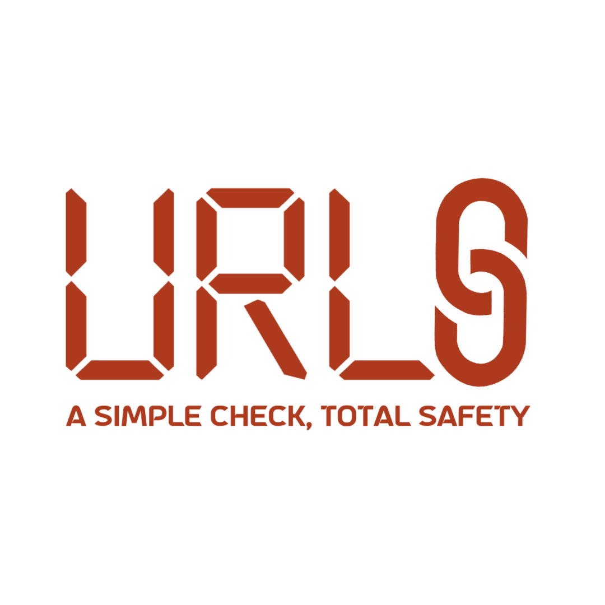

# kisia-project

## KISIA 제2회 정보보호 개발자 Hackathon (2024)
- 팀명: 율스 (URLS)
- 주제: 일상생활 속 정보보호
- 프로젝트: 악성 URL 탐지 서비스 (Chrome Extension)
- 발표자료: [율스 악성 URL 탐지 서비스 발표자료](./assets/kisia%20hackathon%20발표자료.pdf)

### 기능
1. Database Check
   - 악성 URL 모아 구축한 율스만의 database
   - 계속해서 쌓여 나가는 방식으로 종합적 DB 구축
2. External API Check
   - 시장에 있는 malicious url check API를 이용한 cross-checking
   - 교차 검증을 통한 더욱 확실한 결과 도출
3. AI Check
   - 주어진 URL의 domain, parameter, directory 등 분석
   - 실제 URL에 접속하여 JS 수집
   - 정적, 동적 모델을 통한 분석

### 기술 스택
- Frontend: HTML, CSS, JavaScript
- Backend: Python, Flask, NestJS, PostgreSQL, CI/CD
- AI: LSTM, b-LSTM, CodeBERT, Jalangi, NLP, Random Forest
- Data:
  - geeksonsecurity/js-malicious-dataset
  - HynekPetrak/javascript-malware-collection
  - kaggle malicious url dataset
  - Universit of Maribor malicious url dataset

### Demo
- [율스 악성 URL 탐지 서비스 탐지 시연 영상](https://drive.google.com/file/d/1MR6lOnnYuWg-IO3W-muJ0djdQdglDErT/view?usp=drive_link)
- [율스 악성 URL 탐지 서비스 미탐지 시연 영상](https://drive.google.com/file/d/1UIsQsFgGIL_0CFuzHnU2InUrbaD2Cp_s/view?usp=sharing)